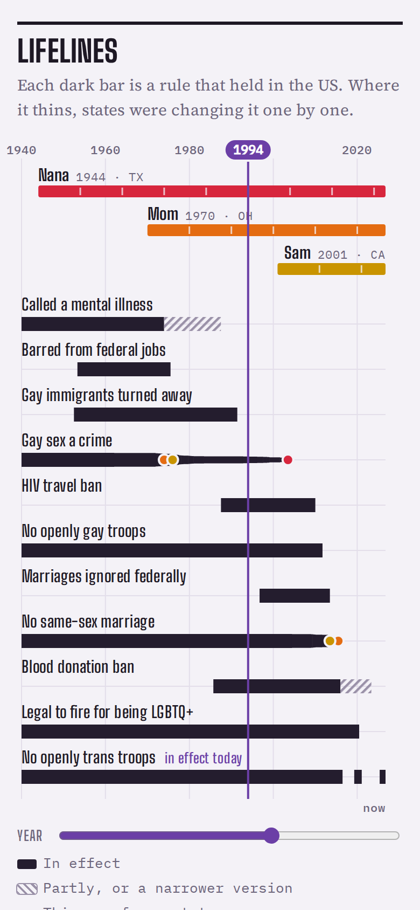
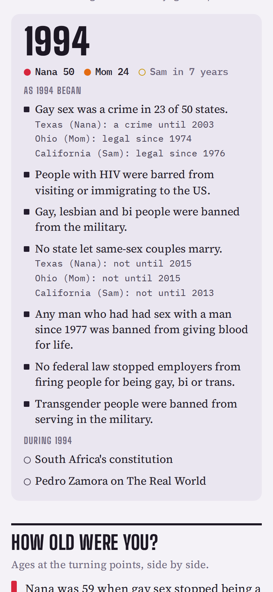
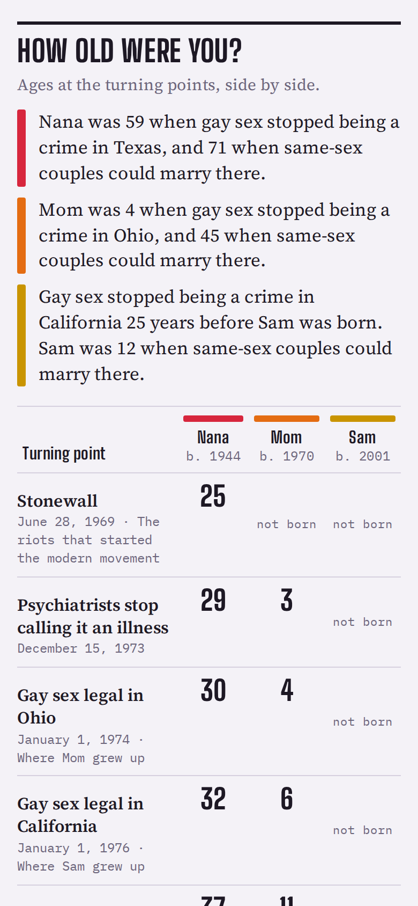
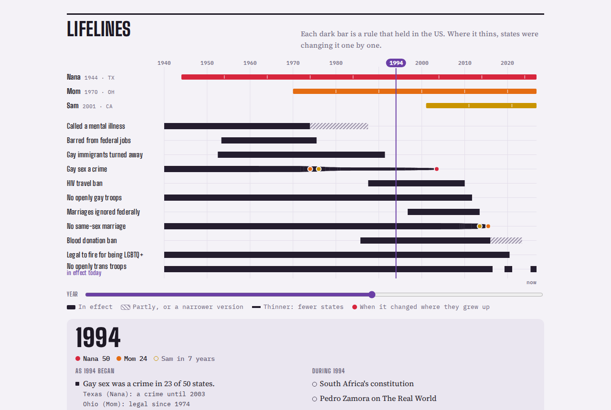

# Not So Long Ago

**Use it: [junkdrawer.works/not-so-long-ago](https://junkdrawer.works/not-so-long-ago/)**

**LGBTQ+ history, laid across your own life and the lives of the people you love.**

Put in up to six people (you, a parent, a grandparent, a partner, a kid) with the year each was born and the state they grew up in. The page draws a lifeline for each of them above bars showing when US rules against LGBTQ+ people were in effect: when gay sex was a crime, when psychiatry called it an illness, when gay people were barred from federal jobs and the military, when same-sex couples couldn't marry. Then it tells you how old each of you was when each rule changed.

<p align="center">
  
  &nbsp;
  
  &nbsp;
  
</p>

<p align="center">
  
</p>

<sub>Screenshots use the example family: Nana, born 1944 in Texas; Mom, 1970 in Ohio; and Sam, 2001 in California.</sub>

## How it works

- **Lifelines.** Drag across the chart, or use the year slider, to see any year: who was how old, which rules still held (with a count of states for the state-by-state ones, and the status in each person's home state), and what happened that year.
- **How old were you?** The turning points in a table, one column per person, plus a sentence for each person about their own state.
- **Year by year.** About 150 events from 1924 to 2026, filterable by kind (law, organizing, health and HIV, trans lives, politics, culture, around the world), with each person's age at the top of every year. Events for each person's home state (when its sodomy law ended, when marriage came) are added automatically.
- **Share.** Copies a link with the people in it, so a family can open the same lifelines.
- No account and no server. The people you put in stay in your browser. It works offline and installs to a phone's home screen.

## Running it

It's a static site: plain HTML, CSS and JavaScript, with no build step. The whole app is `index.html`.

```sh
npx serve .                   # or any static file server, then open the printed address
npm test                      # uses it in Chromium through the real page (needs Playwright)
node tools/screenshots.mjs    # redraws the README screenshots in docs/
node tools/make-icons.mjs     # redraws the PNG icons from icon.svg
```

To put it online with GitHub Pages: **Settings → Pages → Build and deployment → Deploy from a branch**, then pick `main` and `/ (root)`.

### Files

- `index.html`: the page, its styles and script, and the data (see below).
- `fonts/`: Big Shoulders Display, Big Shoulders Text, Source Serif 4 and IBM Plex Mono (SIL Open Font License), served from here so nothing loads from elsewhere.
- `sw.js`: keeps a copy for using offline.
- `manifest.webmanifest`, `icon.svg`, `icon-*.png`: for installing it to a home screen. `tools/icon-full-bleed.svg` is the square version for the maskable and Apple icons.
- `og.png`: the picture shown when a link is shared.
- `docs/`: the README screenshots, made by `tools/screenshots.mjs`.
- `test/e2e.mjs`: puts people on the lifelines, moves through the years and filters the list, then checks it fits a phone and works offline.

## The data

The events and the per-state dates are plain text blocks near the bottom of `index.html`, one line each, so they're easy to correct:

- `#data-events`: `date | category | tone | title | blurb`. Dates are `YYYY-MM-DD`, `YYYY-MM` or `YYYY`. Tone is `+` for a step forward, `-` for a setback or a loss, `.` for a moment.
- `#data-states`: `code | name | decriminalized | how | marriage | how | earlier marriage windows | first civil union or partnership | note`.

The bars (the "lanes") are in the `LANES` list in the script, each with its start and end dates and a note shown under **About the bars**.

Every date was checked against public sources: Supreme Court opinions, statutes and federal agency notices, and the Wikipedia articles that cite them (*Sodomy laws in the United States*, *Same-sex marriage in the United States*, and the history timelines). A few older state repeal dates are known only to the year (New Hampshire 1975, West Virginia 1976, Indiana, Vermont and Wyoming 1977), and are shown that way. Recent entries are current to September 2026: the 2025 trans military ban (still in effect, apart from the plaintiffs a June 2026 appeals ruling protects), the passport policy the Supreme Court let take effect in November 2025, and the Court's refusal to hear Kim Davis's challenge to Obergefell. When something changes, add a line.
